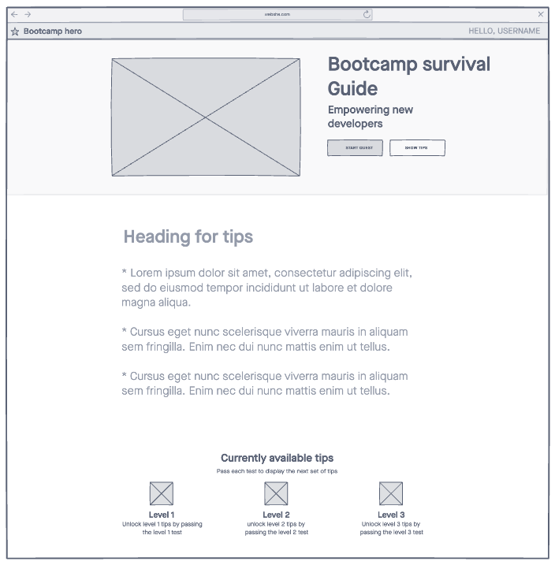

# Boot Camp Survival Guide

The Boot Camp Survival Guide is an interactive web application designed to help new devs navigate and succeed in coding bootcamps. Users can start a "quest" where they go through a serious of quiz question that unlock helpful tips to support learners throughout their bootcamp journey.

## Author: Thomas Basham

### Links and Resources

- [JavaScript Documentation](https://developer.mozilla.org/en-US/docs/Web/JavaScript)
- [Local Storage](https://www.w3schools.com/jsref/prop_win_localstorage.asp)
- [DOM Manipulation](https://www.w3schools.com/js/js_htmldom_elements.asp)
- [OpenAI GPT-3](https://openai.com/)
- [Prompt for getting quiz Questions](https://chat.openai.com/share/ac6d1181-f867-4a34-8b19-a29f9cd14102)

### Lighthouse Accessibility Report Score

### Reflections and Comments

I used this project to reinforce the tools and concepts that will be used when teaching a class at Codex Academy. As a final project, the students are challenged to build an app using HTMl, CSS, and JavaScript. Some requirements for the project are that they use local storage to persist data across screen refresh and that the pages contain dynamic data that changes based on user input. Some challenges I had was not using advanced concepts that are not in the curriculum for this particular class. My goal was to emulate the skills of a well performing student, and not exceeding that.
